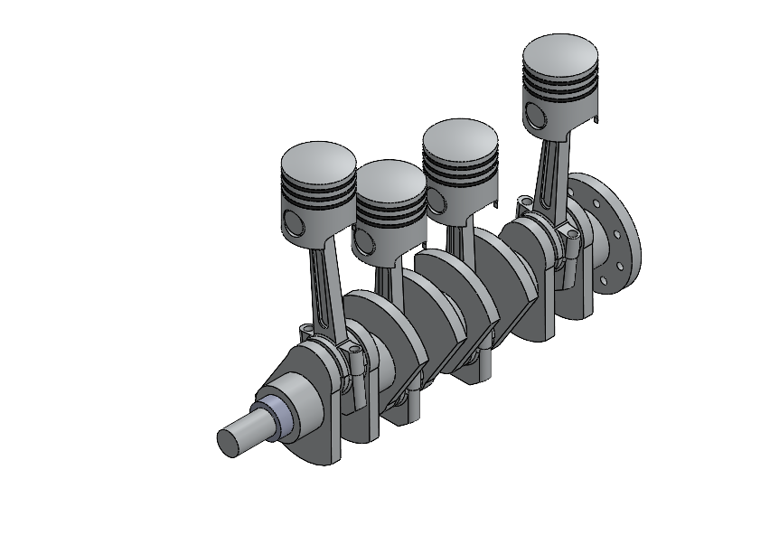

# Four-Cylinder Piston–Crankshaft Assembly

## Overview

This project presents the CAD modelling and assembly of a four-cylinder piston–crankshaft mechanism using SolidWorks.

The assembly represents the fundamental mechanical arrangement used to convert the reciprocating motion of pistons into rotary motion through the crankshaft.

The model includes the major mechanical components of the piston–crank mechanism, including pistons, connecting rods, and the crankshaft.

---

## Project Objectives

The main objectives of this project were:

- To develop a three-dimensional CAD model of a four-cylinder piston–crankshaft mechanism.
- To model the major components of the mechanism.
- To assemble the components using appropriate assembly relationships.
- To understand the relative motion between the piston, connecting rod, and crankshaft.
- To develop practical skills in mechanical part modelling and assembly design.
- To create a clean mechanical CAD model suitable for engineering documentation and visualization.

---

## Software Used

| Software | Purpose |
|---|---|
| SolidWorks | Part modelling and assembly design |
| SolidWorks Assembly | Component integration and mechanism development |

---

## Assembly Components

The main components represented in the assembly include:

### 1. Pistons

Four piston components are arranged within the assembly to represent the reciprocating elements of the mechanism.

### 2. Connecting Rods

Connecting rods link the pistons to the crankshaft and provide the mechanical connection required for motion transmission.

### 3. Crankshaft

The crankshaft contains the crank geometry required to convert the reciprocating motion of the pistons into rotational motion.

### 4. Piston–Crank Mechanism

The complete assembly combines the pistons, connecting rods, and crankshaft into a single mechanical system.

---

## CAD Model

### Isometric View



The isometric view shows the complete four-cylinder piston–crankshaft assembly and the relative arrangement of the major components.

---

## Design and Modelling Workflow

The general modelling workflow followed for the project was:

```text
Concept
   |
   v
Individual Component Modelling
   |
   +----> Piston
   |
   +----> Connecting Rod
   |
   +----> Crankshaft
   |
   v
Assembly Creation
   |
   v
Component Positioning
   |
   v
Assembly Verification
   |
   v
Final CAD Model
